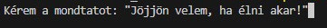

# Random_text

## Ez egy Programozás Karrieres Gyakorló feladat

> Ez az egyszerű kis pythonban írt program azt a célt szolgálja, hogy megértsem, vagy megértessem a a filébe írást python nyelven. A program a felhasználótól bekér egy mondatot, azt rögzíti majd ezután véletlenül választ egy mondatott a data.txt filéből és azt kiírja a konzolra. Az alábbiakban részletesen ismertetem a program működését. (Kiegészítés: Az átláthatóság miatt a programban több helyen is a time metódussal várakoztatásra kerül a program)

### A program bekér a felhasználótól egy mondatot, amely string ként bekerül az „x” változóba.

### Ezt követően a filemuvelet() nevű fügvény meghívásával a data.txt filébe kerül elmentésre a mondat.

> A felhasználó értesítést kap a művelet megkezéséről.

(img)

> Valamint annak befejezéséről is

(img)

### Ezt követően a program kiolvas egy random mondatot a data.txt filéből.

> A folyamat elkezdéséről értesíti a felhasználót (a véltelen választáshoz random metódust használtam):

(img)

> Majd kiírja a választott értéket a konzolra.

(img)

### A program futása itt leáll.
